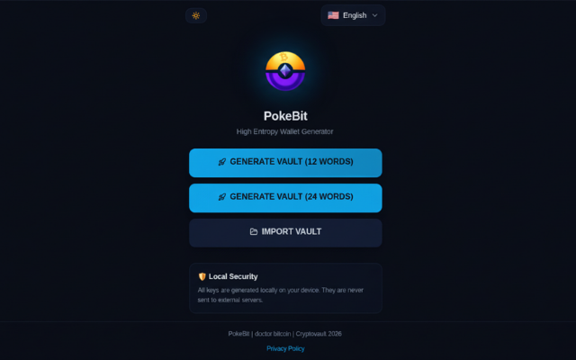
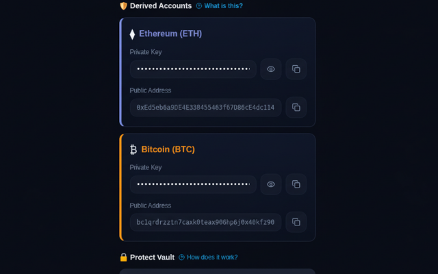
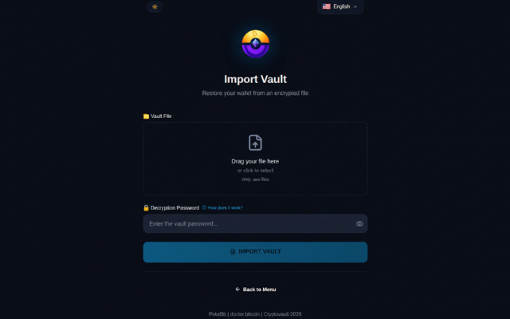

 

  

<h1 align="center">PokeBit</h1>
<h3 align="center">🔐 High Entropy Wallet Generator</h3>

  <strong>Generate secure cryptocurrency wallets with military-grade security, completely offline.</strong>

  <a href="https://pokebit.xyz">🌐 Web App</a> •
  <a href="https://chromewebstore.google.com/detail/pokebit-high-entropy-wall/jfeggeoablgcjdpeadembmajifdagbce">🧩 Chrome Extension</a> •
  <a href="https://pokebit.xyz/privacy">📜 Privacy Policy</a>

  
  
  
  

---

## 📸 Screenshots (3)

  
  
  

---

## ✨ Features

### 🎲 High-Entropy Generation
Generate 12 or 24-word BIP-39 seed phrases using cryptographically secure random number generation. Each word has an equal **1/2048 probability** of being selected.

### 💰 Multi-Currency Support
Automatically derives wallet addresses for:
- **Ethereum (ETH)** - BIP-44 path `m/44'/60'/0'/0/0`
- **Bitcoin (BTC)** - BIP-84 native SegWit (`bc1q...`) path `m/84'/0'/0'/0/0`

### 🛡️ Military-Grade Encryption
Export your wallet as an **AES-256 encrypted file** (`.aes`). Share it safely via email or cloud storage - without the password, it's unreadable.

### 🔒 100% Offline Operation
All cryptographic operations happen locally on **YOUR device**. No servers, no APIs, no data transmission. Ever.

### 🚫 Zero Data Collection
We don't collect, store, or transmit **ANY data**. No analytics, no tracking, no cookies. Your privacy is absolute.

### 📥 Import & Export
Easily backup and restore your wallets with encrypted `.aes` files. Change passwords anytime when re-exporting.

### 🌍 Multi-Language Support
Available in:
- 🇺🇸 English
- 🇪🇸 Español
- 🇨🇳 中文
- 🇮🇳 हिन्दी
- 🇷🇺 Русский

---

## 🚀 Get Started

### Option 1: Web Application (Recommended)
Visit our secure web app - no installation required:

**👉 [https://pokebit.xyz](https://pokebit.xyz)**

### Option 2: Chrome Extension
Download from the Chrome Web Store for quick access from your browser toolbar:

**👉 [Get PokeBit on Chrome Web Store](https://chromewebstore.google.com/detail/pokebit-high-entropy-wall/jfeggeoablgcjdpeadembmajifdagbce)**

---

## 🔐 Security Architecture

| Feature | Standard | Description |
|---------|----------|-------------|
| Seed Phrase | BIP-39 | 2048-word dictionary, 11 bits per word |
| Key Derivation | BIP-32/44/84 | Hierarchical Deterministic (HD) wallets |
| Encryption | AES-256 | Military-grade symmetric encryption |
| Ethereum Keys | secp256k1 + Keccak-256 | Standard Ethereum derivation |
| Bitcoin Keys | secp256k1 + Bech32 | Native SegWit addresses (bc1q...) |

---

## ⚠️ Important Security Notes

> **Your seed phrase is your wallet. Protect it like your life depends on it.**

- ✅ Always backup your seed phrase in a **secure, offline location**
- ✅ Use **strong passwords** (8+ characters, mixed case, numbers, symbols)
- ✅ Store your `.aes` file in multiple secure locations
- ❌ **Never share** your seed phrase or private keys with anyone
- ❌ There is **no password recovery** - if you lose it, you lose access

---

## 🎯 Perfect For

- 🔰 **Crypto beginners** who want simple, secure wallet generation
- 🕵️ **Privacy-conscious users** who don't trust online services
- ❄️ **Cold storage enthusiasts** 
- 💎 **HODLers** who believe in "Your Keys, Your Cryptos"

---

## 💡 The PokeBit Philosophy

> **"Your Private Keys, Your Cryptos"**

We built PokeBit because we believe:
- You should **own** your cryptocurrency, not trust it to exchanges
- Security should be **simple**, not complicated
- Privacy is a **right**, not a privilege
- Offline is **safer** than online

---

## 📞 Support

- 📧 Email: contact@pokebit.xyz

---

  <strong>©2026 PokeBit</strong> by [doctor.bitcoin](https://ud.me/doctor.bitcoin)

  <a href="https://pokebit.xyz/privacy">📜 Privacy Policy</a>

